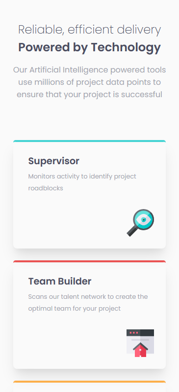

# Frontend Mentor - Four card feature section solution

This is a solution to the [Four card feature section challenge on Frontend Mentor](https://www.frontendmentor.io/challenges/four-card-feature-section-weK1eFYK). Frontend Mentor challenges help you improve your coding skills by building realistic projects.

### Links

- Live Site URL: [live preview](https://serhii-bielik.github.io/fm-four-card-feature-section/)
- Frontend Mentor - [@serhii-bielik](https://www.frontendmentor.io/profile/serhii-bielik)

### Screenshots

